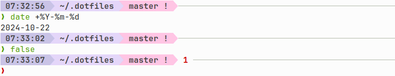

# My Dot Files

My config files, aka `dotfiles`, heavily commented.

## Required software

```
sudo apt install \
    safe-rm \
    ruby \
    jq \
    xclip \
    htop \
    tree \
    libnotify-bin \
    imwheel
```

- safe-rm: safer rm command for not crying in despair after `rm -rf /home/tom /something` (notice the space)
- ruby: required for `git wtf` script
- imwheel: to use the additional buttons of my mouse to close tabs and windows

## Installation

``` bash
git clone https://tomsquest@github.com/tomsquest/dotfiles.git ~/.dotfiles
cd ~/.dotfiles
./install.sh
```

## Main features

- Heavily commented ZSH configuration: completion, key bindings...
- Heavily commented Vim configuration: plugins, key bindings...
- ZSH plugins with [Zgen](https://github.com/tarjoilija/zgen)
- Vim config, using [Vundle](https://github.com/gmarik/vundle)
- Bash ["Sensible" config](https://github.com/mrzool/bash-sensible)
- Linux Brew to install utilities (Eza, Jump, Fzf, etc.)
- Search file and directories with [Fzf](https://github.com/junegunn/fzf)
- Git config
- etc.

The current prompt is simple and efficient:
- Time, Directory, Git branch/state, Last command error if it failed
- A separator bar between each command
- No useless icon
- Pastel colors

