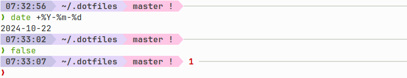

# My Dot Files

My config files, aka `dotfiles`, heavily commented.

Target: Ubuntu with KDE Plasma (Wayland).

## Installation

``` bash
git clone https://github.com/tomsquest/dotfiles.git ~/.dotfiles
cd ~/.dotfiles
./install.sh
```

`install.sh` can be run again safely. It:
- installs the apt packages (zsh, git, safe-rm, ffmpeg...)
- links the config files into `$HOME`
- installs [Zgenom](https://github.com/jandamm/zgenom) and [Bash Sensible](https://github.com/mrzool/bash-sensible)
- installs [Homebrew](https://brew.sh) and the CLI tools (bat, eza, fd, fzf, jump, neovim, ripgrep, starship, uv...)
- installs the asdf plugins
- installs the JetBrainsMono Nerd Font
- sets zsh as the default shell

## Main features

- Heavily commented ZSH configuration: completion, key bindings, aliases...
- ZSH plugins with [Zgenom](https://github.com/jandamm/zgenom)
- Prompt with [Starship](https://starship.rs)
- [Ghostty](https://ghostty.org) terminal config
- Neovim config, based on [kickstart.nvim](https://github.com/nvim-lua/kickstart.nvim)
- Search file and directories with [Fzf](https://github.com/junegunn/fzf)
- Git config (commits signed with SSH)
- `rm` protected by [safe-rm](https://launchpad.net/safe-rm)
- Scripts in `bin/`: `alert` (notify when a command ends), `retry`, `ww` (run or raise a window in KDE)...

The current prompt is simple and efficient:
- Time, Directory, Git branch/state, Last command error if it failed
- A separator bar between each command
- No useless icon
- Pastel colors


